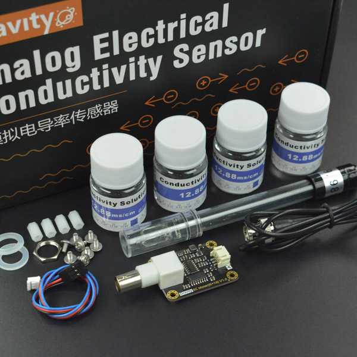

# DFRobot_EC10
- [English Version](./README.md)

DFRobot Gravity: 模拟电导率计（K=10）专用于测量高电导率的液体，如海水、浓盐水<br>
等，量程达100ms/cm，可用于海洋渔场、海洋水族馆等海产养殖领域的水质检测。<br>



## 产品链接 (https://www.dfrobot.com.cn/goods-1865.html)
     DFR0300: Gravity: 模拟电导率计V2 (K=10) 新款电导率计

## 目录

  * [概述](#概述)
  * [库安装](#库安装)
  * [方法](#方法)
  * [兼容性](#兼容性)
  * [历史](#历史)
  * [创作者](#创作者)
## 概述
提供一个Arduino库，通过从DFR0300-H读取液体的电导率。

## 库安装

要使用这个库，首先下载库文件，将其粘贴到\Arduino\libraries目录中，然后打开示例文件夹并在文件夹中运行演示程序。

## 方法
```C++
  /*!
   * @fn DFRobot_EC10
   * @brief Constructor 
   */
  DFRobot_EC10();
  
  /*!
   * @fn ~DFRobot_EC10
   * @brief destructor 
   */
  ~DFRobot_EC10();

  /*!
   * @fn begin
   * @brief 传感器初始化
   */
  void begin();
  
  /*!
   * @fn calibration
   * @brief 传感器校准,为保证精度，初次使用的电极，或者使用了一段时间的电极，需要进行校准
   * @param voltage 模拟电导率计测量12.88ms/cm标准液所获得的电压
   * @param temperature 校准液体的温度
   * @param cmd 校准命令
   */
  void calibration(float voltage, float temperature,char* cmd);
  
  /*!
   * @fn calibration
   * @brief 传感器校准,为保证精度，初次使用的电极，或者使用了一段时间的电极，需要进行校准
   * @param voltage 模拟电导率计测量12.88ms/cm标准液所获得的电压
   * @param temperature 校准液体的温度
   */
  void calibration(float voltage, float temperature);   

  /*!
   * @fn readEC
   * @brief 获取液体的电导率
   * @param voltage 测得的模拟电压
   * @param temperature 待测液体的温度
   */
  float readEC(float voltage, float temperature); 
```

## 兼容性

MCU                | Work Well    | Work Wrong   | Untested    | Remarks
------------------ | :----------: | :----------: | :---------: | -----
Arduino uno        |      √       |              |             | 
FireBeetle-ESP8266        |      √       |              |             | 
FireBeetle-ESP32        |      √       |              |             | 
mpython        |      √       |              |             | 
microbit        |      √       |              |             | 


## 历史

- 2020/05/05 - Version 1.0.0 released.

## 创作者

Written by fengli(li.feng@dfrobot.com), 2022.05.05 (Welcome to our [website](https://www.dfrobot.com/))
